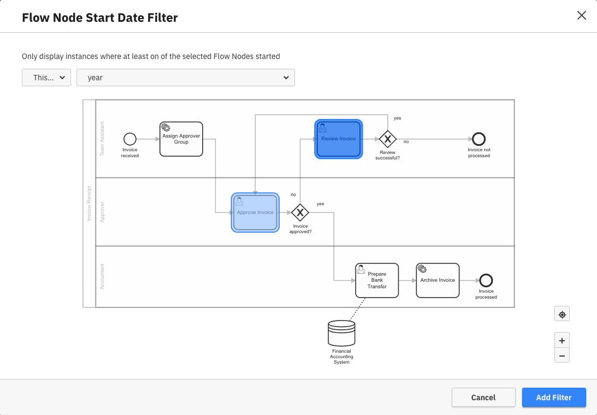
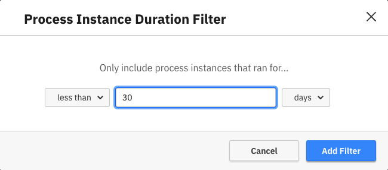
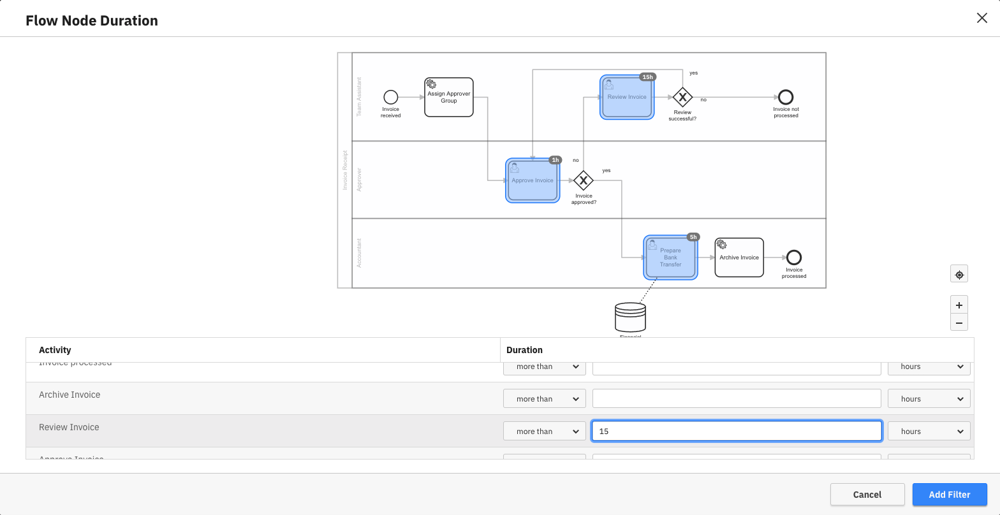
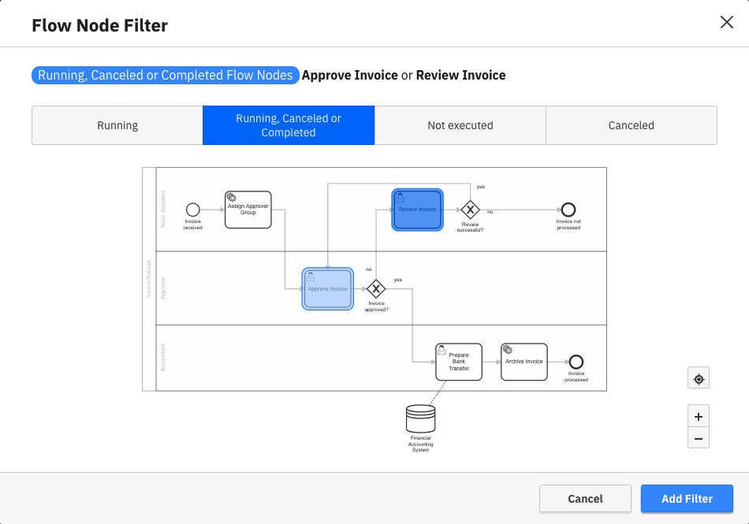
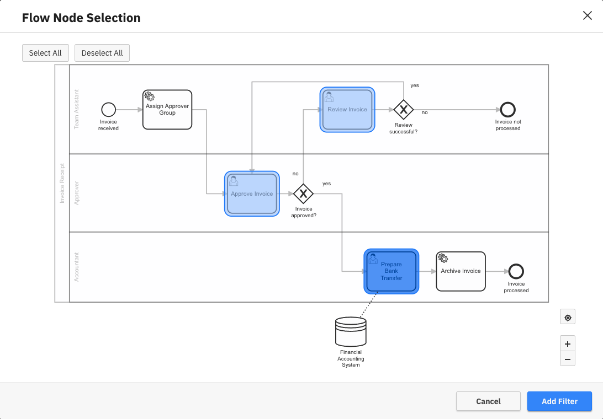
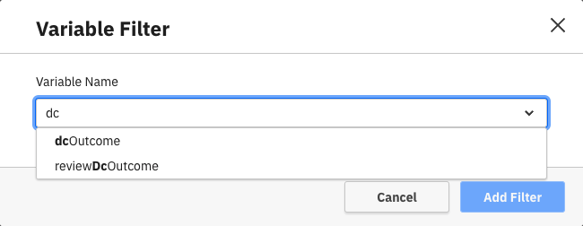
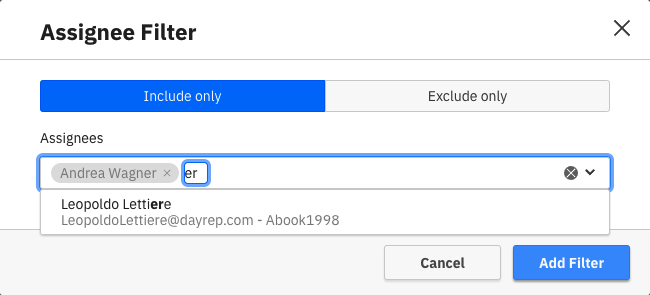
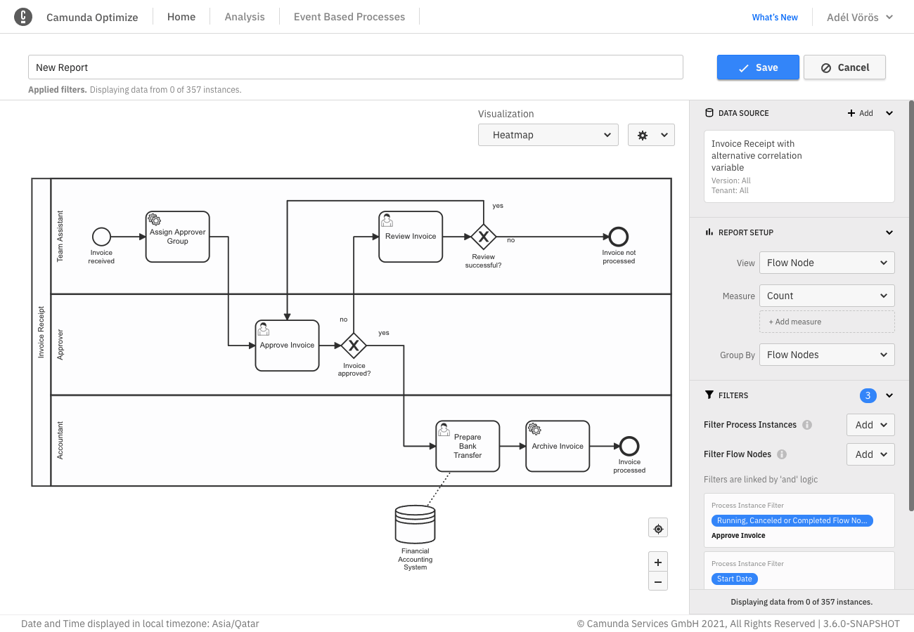

Locating flaws in your process models can be a huge challenge when you have millions of process instances to sift through. Define filters in Optimize to narrow down your view to only a subset of process instances.

Camunda Optimize offers various ways of filtering your data, such as filter by:

- [Instance state](#instance-state-filters)
  - [Running/Completed process instances](#running-completed-instances-only-filter)
  - [Canceled/Non Canceled process instances](#canceled-instances-only-filter)
  - [Suspended/Non Suspended process instances](#suspended-non-suspended-instances-only-filter)
- [Flow Node Status Filter](#flow-node-status-filter)
- [Start/End dates](#date-filters)
  - [Process instance date](#process-instance-date-filter)
  - [Flow Node date](#flow-node-date-filter)
- [Duration](#duration-filters)
  - [Process instance duration](#process-instance-duration-filter)
  - [Flow Node duration](#flow-node-duration-filter)
- [Executed Flow Nodes](#flow-node-filter)
- [Flow Node Selection](#flow-node-selection)
- [Variables](#variable-filter)
- [Assignee and Candidate Group](#assignee-and-candidate-group-filters)
- [Incident](#incident-filter)
- [Combined filters](#combined-filters)

## Filter behavior

There are two ways to filter the data in Optimize:

1. Instance filters: All filters can be used to filter instances in single reports and during branch analysis.
2. Flow node data filters: These filters can be used if you not only want to filter instances but you additionally need to filter the content of instances e.g. flow nodes. Since not all filters can be applied on flow nodes, only compatible ones can be used as a flow node data filter. Flow node filters also exclude all instances from the result which do not contain at least one flow node that matches the filter.

Additionally, if the report contains multiple data sources, filters need to specify which definition they apply to. Some filters can apply to multiple definitions at once, while other filters are specific to a certain process definition, e.g. because they rely on the flow nodes present in the definition.

## Instance state filters

### Running/completed instances only filter

By default, a report considers all process instances, regardless of whether they are still running or not. This behavior can be adjusted with the `Running Instances Only` and `Completed Instances Only` filters. Be aware that setting one of those filters (e.g. `Running Instances Only`) while the other one is already set (e.g. `Completed Instances Only`), will show a warning message since these two filters are incompatible with each other and will not show any data.

### Canceled instances only filter

If the `Canceled Instances Only Filter` is applied, the report will only consider those instances which were terminated before completion, either 
internally or externally. Be aware that adding this filter along with the `Running Instances Only` will show a warning message since these filters are incompatible and will not show any data.

### Non canceled instances only filter

As opposed to the `Canceled Instances Only Filter`, applying the `Non Canceled Instances Only` filter will make Optimize query only those instances which were _not_ canceled during 
their execution. This means that only active and completed instances are considered, externally or internally terminated instances are not included in the report.

### Suspended/non suspended instances only filter

By default, a report considers all process instances, regardless of whether they are suspended or not. Adding this filter makes it possible to only evaluate process instances that are in the suspension state. Please note that if you have enabled history cleanup, this might affect the accuracy of this filer since the suspension state is imported from historic data.

## Flow node status filter

Some flow nodes can take a relatively long time to complete, e.g. user tasks or long-running service tasks. By default, a report includes all flow nodes in the calculations, whether they are currently running, canceled, or already completed. You can change this behavior by adding a flow node status filter as a [flow node data filter](#filter-behavior). 

Adding one of the flow node status options will filter both instances and flow nodes according to the selected status: 

- For instance reports - The filter will only include instances that have at least one flow node matching the filter criteria. This behavior can be seen if you are in variable, incident, or raw data reports.
- For flow node reports - Flow nodes that do not match the filter criteria will be excluded from the results. 

This behavior can be seen if you are in flow nodes or user task reports.

Here are the possible options for this filter:

- Running flow nodes only - Your report will only collect information from flow nodes that are currently running.
- Completed flow nodes only - Considers only successfully completed flow nodes
- Canceled flow nodes only - Considers only canceled flow nodes
- Completed or canceled flow nodes only - Considers all completed flow nodes regardless of whether they were canceled or not

:::note
For incident reports, flow node status filters always behave as instance filters and do not filter flow nodes. 
:::

## Date filters

In Optimize, there are two kinds of date filters: the start and the end date filter. Each of these filters can be applied on [process instance](#process-instance-date-filter) and on [flow node](#flow-node-date-filter) dates.

There are multiple ways in which you can define your date filters:

- One way is to set the filter to a current amount of time. e.g. today, this week, this month, etc. In such cases, the filter does not remain static but moves with time to deliver a subset of the data according to the selected time interval.

- Another way to define the filter is to set it to a previous amount of time. e.g. yesterday, last week, last month, etc. This filter also moves with time and is automatically adjusted to cover completed periods of time. To clarify, let's take the following example: Today is Wednesday March 11th. If you set a process instance start date filter to 'Last... + week', you get all process instances that were started from Monday March 2nd to Sunday March 8th. Now a Week passes and we have Wednesday March 18th. Applying the same filter now filters the process instances which were started from Monday March 9th to Sunday March 15th.

- To cover previous time periods up the current moment of time, you can use the 'Rolling' option. To clarify this option, let's take the following example: today is March 28th. If you set a process instance start date filter to the last three days, you get all process instances that were started from March 26th to March 28th. Now a day passes and we have March 29th. Applying the same filter now filters the process instances which were started from March 27th to March 29th.

- If you do not want the filter to be completely dynamic, you can also select `Between`, `Before` or `After`. 
 - The `Between` option only consider process instances that were started or ended within a fixed date range, e.g. filter all process instances between 2018-01-01 and 2018-01-26. This range is fixed and does not change.  
- In the same way, you can select `After` or `Before` option to only consider process instances that started or ended after/before a fixed date.

The start and the end date filters are independent and can be applied to a report simultaneously. However, be aware that each of these filters can only exist once. If, for example, you define a new start date filter when another one already exists, the second one will replace the first one.

### Process instance date filter

Applying a process instance start or end date filter will result in a report considering only process instances that started or ended within the defined range of dates. Note that reports with a process instance end date filter applied will only consider completed process instances.

As an alternative way to create a process instance start date filter, if your report is visualized as bar or line chart, you can directly select the desired filter interval in the chart itself.

### Flow node date filter

Similar to process instance date filters, flow node date filters allow you to filter the report based on flow node start or end dates. Note that reports with a flow node end date filter will only consider data from completed flow nodes. 

This filter type can be applied either as a [Process Instance](#filter-behavior) or as a [flow node](#filter-behavior) filter: 

- When applied as a process instance filter, you are required to select the flow nodes that are to be relevant to the filter, yielding a report which will only consider those process instances where one or more of the selected flow nodes match the configured filter.

- When added as a flow node filter, there is no flow node selection. The resulting report automatically only includes data from those flow nodes which match the given filter.

## Duration filters 

### Process instance duration filter

The `Process Instance Duration Filter` allows you to only regard process instances whose execution from start to end took a certain amount of time. For instance, you can filter process instances that took more than three days or less than five seconds.

:::note
This filter shows only completed process instances, since the total duration of running process instances is not yet known.
:::

### Flow node duration filter

If the `Flow Node Duration Filter` is applied as an instance filter, it will only regard process instances where one or more flow nodes took a certain amount of time for their execution. For instance, you can filter process instances where a flow node took more than three days or less than five seconds. 

If applied as a flow node filter, it will filter flow nodes and only show the flow nodes that were selected in the filter.

:::note
For incident reports, flow node duration filters always behave as instance filters regardless of where they were defined. 
:::

## Flow node filter

Retrieve only those process instances that executed certain flow nodes within your process by using the `Flow Node Filter`. Selecting several values at once means that all the selected flow nodes need to have been executed at least once in the process instance lifetime. At the top of the flow node filter modal you can see a preview of the filter you are about to create. You can also filter process instances where certain flow nodes were not executed.

## Flow node selection

In flow node and user tasks reports, all flow nodes are included in the result by default. This could result in a lot of table rows or chart entries which makes the visualization hard to read. This filter allows you to specify which flow nodes are included and deselect the ones that are not relevant to the report.

## Variable filter

Use the `Variable Filter` to retrieve only those process instances which hold the specified variable value for the selected variable. 

:::note
Variable filters can only filter for the final value of the variable. For instance, assume you want to analyze only those process instances which have the variable `department` with the value `marketing`. Say you also have some instances where this variable had the value `marketing` at the start of the execution yet this was later reassigned to the value `sales`.These instances will not be included in the filter.
:::

:::note
The variable filter can only filter for variables of a [primitive type](https://docs.camunda.org/manual/latest/user-guide/process-engine/variables/#supported-variable-values)
:::

:::note
To use complex types like object, you can use the Variable Import Customization feature to transform your object variables into primitive type variables.
:::

Start creating a variable filter by searching for and selecting a variable from the suggested list of variable names.

There are four types of variables that you can filter for:

- Boolean variables: They can have the state `true`, `false`, `null`, or `undefined`.
- String variables: Two types of operators are available for variables of type String. You can either filter by an exact variable value (`is` and `is not`) or filter by a substring (`contains` and `does not contain`).
  - For the operators `is` and `is not`, the first 10 values are loaded and displayed. If the variable has more than 10 values a `Load More` button is shown to be able to extend the list as much as you need. You can also search through the whole list of values using the search input field. The list only contains variable values that already appeared in one of the instances of the process. If you want to filter by a variable value that is not in the list of available values, you can click the `+ Value` button and add a custom variable value.
  - In case the `is` option of the toggle button is selected, checking one or more values means that you want to see only those process instances where the variable value equals one of the checked values (this corresponds to the `or` operator in boolean logic). In case the `is not` option of the toggle button is selected, checking one or more values means that you want to see only those process instances where the variable value does not equal any of the checked values (this corresponds to the `and` operator in the boolean logic).
  - For the operators `contains` and `does not contain`, you can add one or multiple values that should match a substring of the variable value. For the `contains` operator, adding one or more values means that you want to see only those process instances where the variable value contains one of the entered values (this corresponds to the `or` operator in boolean logic). In case the `does not contain` operator is selected, adding one or more values means that you want to see only those process instances where the variable value does not contain any of the entered values (this corresponds to the `and` operator in boolean logic).
  - There is an option to include the null or undefined values of the selected variable in the result. By using the same option, it is also possible to show all the values except the null or undefined by selecting the `is not` option of the toggle button. 
- Numeric variables: Here you have an input field to define whether the variable value in the process instance should be equal, not equal, less than or greater than a certain value. You can even add more input fields and apply the same operation several times at once. In case the `is` option of the toggle button is selected, adding one or more values means that you want to see only those process instances where the variable value equals one of the checked values (this corresponds to the `or` operator in boolean logic). In case the `is not` option of the toggle button is selected, adding one or more values means that you want to see only those process instances where the variable value does not equal any of the checked values (this corresponds to the `and` operator in boolean logic). In case the `is less than` or `is greater than` option is selected, only one value can be entered. 
  - Null or undefined options can be included or excluded from the results in a way similar to string variables.
- Date variables: This filters all instances where the selected date variable has a value within a specified date range. All the options that are available to configure [Date filters](#date-filters) are also available for date variables.

Similar to the other variables, there are two input switches that allow you to exclude or include process instances where a particular date variable is either `null` or `undefined`.

## Assignee and candidate group filters

These filters allow you to include or exclude instances based on the assignee or the candidate group of at least one User Task of a particular process instance.

As shown in the example, it is possible to select one or more assignees or even filter for unassigned instances.

This filter has different behavior depending on where it was [defined](#filter-behavior):

- As a `Flow Node data filter` applied on a user task report: This filter only includes User Task instances that satisfy *all* assignee/candidateGroup filters defined in the report at once. Mutually exclusive filters like having both an inclusive and an exclusive filter on the same assignee do not yield any results in user task reports. 

- As an `instance filter`: this filter includes all process instances where *at least one* user task satisfies one particular assignee/candidateGroup criterion. This means multiple mutually exclusive assignee/candidateGroup filter entries might still yield results for these reports, e.g. if the process definition contains multiple user tasks.

## Incident filter

This filter has different behavior depending on where it was [defined](#filter-behavior):

- As an `instance filter`: this filter will retrieve only those process instances that contain open, resolved, or no incidents (depending on your selection). Here are some examples where this filter can be useful:

    - Creating reports that contain no incidents since the instances that have incidents have very long durations and are influencing your data. 

    - To monitor all the instances from multiple engines that have open incidents. 

    On the other hand, this filter is not useful for counting the number of incidents because instances with an open or resolved instance filter might still contain instances from the other type.

- As a `Flow Node data filter`: this filter will additionally filter the instance incident states to only include incidents of the same type (open or resolved). As an example, This filter can be used to count the number of open or resolved incidents since it considers the incidents of that type exclusively. This filter is currently only useful if you are in an incident view report.

:::note
The incident filter does not currently filter flow nodes regardless of where it was defined.
:::

## Combined filters

All the previously mentioned filters can be combined. Only those process instances which match all of the configured filters
are considered in the report or analysis. The [duration filter](#duration-filters), [flow node filter](#flow-node-filter) 
and [variable filter](#variable-filter) can be defined several times. See the following screenshot for a possible very long combination of filters:

Everyone who has access to the report can add their own filters, e.g. by creating a dashboard that contains that report and 
using dashboard filters. Filters added in such a way are always combined with 
the filters set in the report edit mode. That way, users can reduce the set of process instances that are considered when 
evaluating the report, but not increase the number of instances evaluated above the set the report author specified. 
Users can get access to a report via the sharing functionality or if the report is in a shared collection.