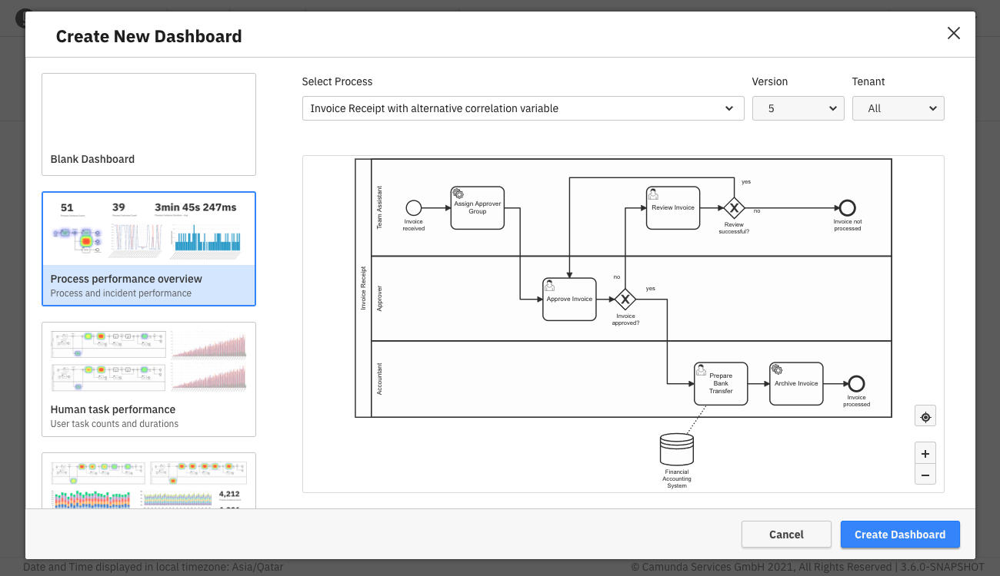
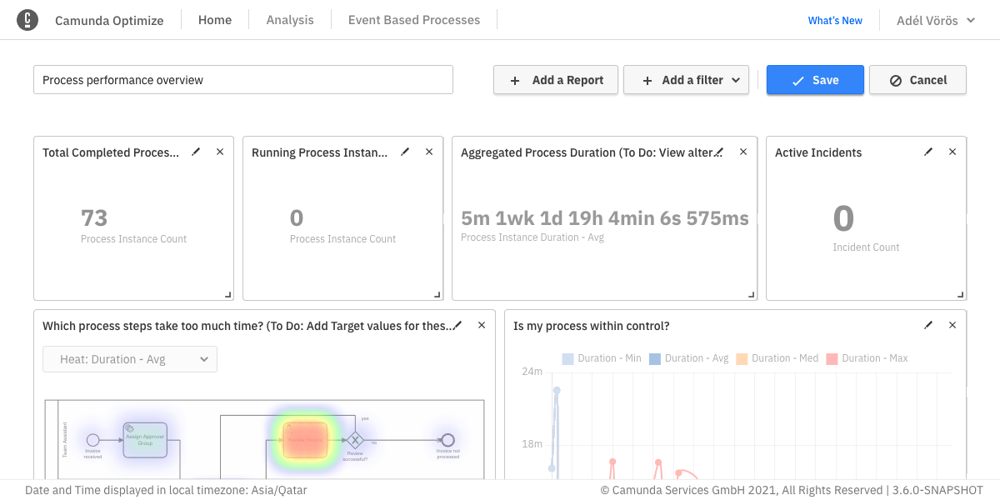
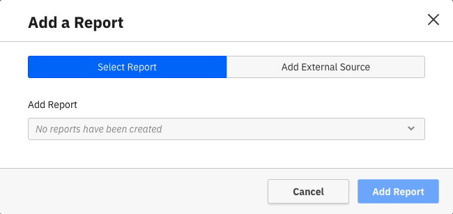
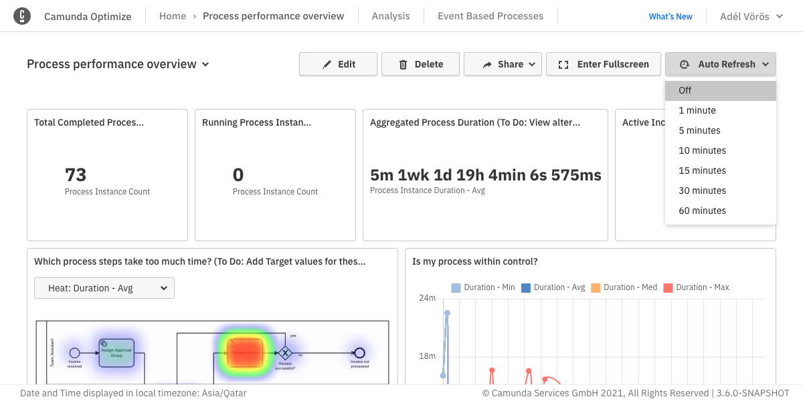
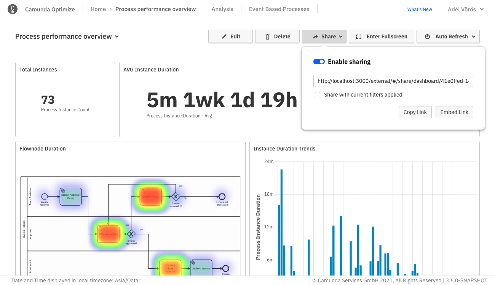
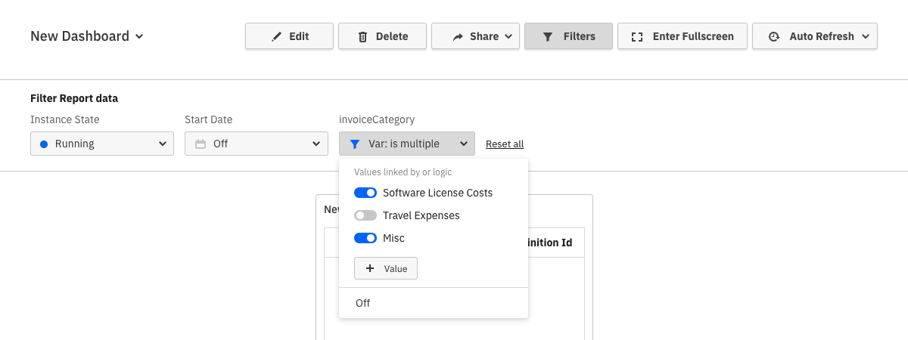

# Overview

Often it is desired to get a quick overview of the business performance by monitoring the underlying processes. To achieve that, you can define reports in Camunda Optimize according to KPIs (Key Performance Indicators) relevant to your business objectives. A dashboard shows multiple reports so you can get an up-to-date view of the productivity of your system.

The dashboard consists of the [edit mode](#edit-mode) and [view mode](#view-mode).

To create a new dashboard, click the **Create New** button on the homepage or collection page and select the **New dashboard** option. This opens a dialog where you can set the dashboard name and select one of multiple dashboard templates. When not creating a blank dashboard, select a process definition. This process definition is used to create new reports for the dashboard.

Creating a dashboard from a template also creates new reports which are saved as soon as the dashboard is saved.

# Edit mode

The edit mode allows you to configure the dashboard and adjust it to your needs, including the following operations:

- Rename your dashboard
- Add/remove a report
- Save the current state with your applied changes
- Cancel changes you already applied to the dashboard
- Set filters available on the dashboard

Once you have prepared all your reports, you can now start to assemble them into a dashboard. Above the dashboard grid, click **Add a report** to open a modal where you can select one of your defined reports and add it to the dashboard:

:::note
If the dashboard is inside a collection, only reports that are in the same collection can be added. If the dashboard is not in a collection, it can only contain reports that are also not in a collection.
:::

In the **Add report** modal, click **Add External Source** to enter the URL of an external data source which should be added to the dashboard. This allows you to create dashboards that combine Optimize reports with data from other services. Such external reports are added as iframes to the dashboard.

To move the report to your desired place, drag it in any direction. As soon as you release the dragged report, it snaps to the closest grid position. Dragging the handle on the lower right corner of each report will resize it. Delete the report from your dashboard by clicking on the **x** button on the upper right corner of each report.

## Adding filters in edit mode

In the dashboard edit mode, there is an **Add a Filter** button which shows a **Filters** panel that allows specifying filters which will become available for the dashboard. The following filters are available:

- Start date: Allows filtering by process instance start date
- End date: Allows filtering by process instance end date
- Instance state: Allows filtering by process instance state, such as running, completed, or canceled
- Variable: Allows filtering by process instance variable value
- Assignee: Allows filtering flow node data by their assignee
- Candidate Group: Allows filtering flow node data by their candidate group

For Variable Filters, specify which variable the filter should apply to. For string and number variables, provide a list of values which should be allowed to be filtered by. 

Additionally, it is possible to allow dashboard users to filter by their own values by checking the **Allow viewer to add filter values** box. In contrast to report filters, adding a value in the modal will not immediately filter by this value, it will only make this value available to filter by in the dashboard.

For **Assignee** and **Candidate Group** filters, the dashboard editor can specify which assignees and candidate groups are available to filter by. In contrast to report filters, adding an assignee or candidate group to the filter will not immediately filter by this value, it will only make this value available to filter by in the dashboard. Additionally, it is possible to allow dashboard users to filter by their own values by checking the **Allow viewer to add filter values** box.

The list of variable names, variable values, assignees, and candidate groups is compiled from all reports on the dashboard.

### Setting a default dashboard filter

After specifying available filters in the dashboard edit mode, editors of the dashboard can also set a default filter. A default filter is always applied when a user initially opens the dashboard. Viewers can still remove filter values to see unfiltered reports, but if a user does not perform any steps to change the filter manually, they will see the reports with the defined default filter.

To set a default filter, dashboard editors can use the added filter options in the filter area. Whatever filter configuration is set there when the dashboard is saved becomes the default filter for the dashboard.

# View mode

Once you have defined what your dashboard should look like, the view mode provides you with all the features to monitor you process, such as:

- Fullscreen: Display the dashboard in fullscreen and only see the essential information of your dashboard - the reports - and hide the header, control panel, and footer. While in fullscreen mode, you can click on the **Toggle Theme** button to switch between the default light theme and a dark theme.

- Auto-refresh: This feature periodically updates the dashboard with the latest data. You can decide how often the update should be performed by setting a time span reaching from 1 to 60 minutes. An animation indicates when the next update is occurring. If you do not wish to use that feature anymore, you can disable it anytime. Note that when refreshing the dashboard page manually or switching to another page in between, the auto-refresh must be enabled again.

To share the dashboard with other people or embed it in a webpage, use the sharing feature of the dashboard. Click on the share button, which opens up a popover. After turning the “enable sharing” switch on, a link is generated which you can send to people who do not have access to Camunda Optimize, and thus enable them to see the dashboard. If you applied filters on the dashboard, you can include them in the shared version of the dashboard by enabling the **Share with current filters applied** checkbox. If the checkbox is not checked, the shared dashboard will include the default filters if any have been set.

You can also click the **Embed Link** button to copy a code to paste into your webpage. Everyone that views the webpage can then see the content of the dashboard. The shared versions of the dashboard allow only to view the dashboard itself. There is no possibility to alter it or interact with any other features of Optimize. Revoke the sharing anytime by disabling the share switch.

To hide the header of the shared dashboard or specific part of it, add the following parameter to the share URL:

`header : titleOnly / linkOnly / hidden`

For example, to completely hide the header from the shared dashboard, add `header=hidden` as shown:

`http://<dashboard share url>?header=hidden`

## Interacting with reports

To see more details about the report on the dashboard, interact with the reports. The kind of interaction always depends on the report itself.

If the interactions do not suffice to get the desired information or you want to edit the report, directly access the report by clicking on its title.

## Adding filters in view mode

In the dashboard view mode, there is a **Filters** button which opens a panel that shows all filters available for this dashboard. More filters can be made available in the dashboard edit mode. If the dashboard editor checked the **Allow viewer to add filter values** box for assignee, candidate group, or variable filters, dashboard viewers can add their own values to filter by.

Filters apply to all process reports on the dashboard. If a report already has filters set, they will be be combined with the dashboard filter. For example, if a report has a filter to only show running instances and a dashboard filter for suspended instances is set, the report will only show instances that are both running and suspended. Dashboard filters are not applied to decision reports or external reports.

Variable filters are only applied to reports whose process definition includes the variable. Otherwise, the filter is ignored for that report. Other dashboard filters and filters defined directly on the report are still applied.